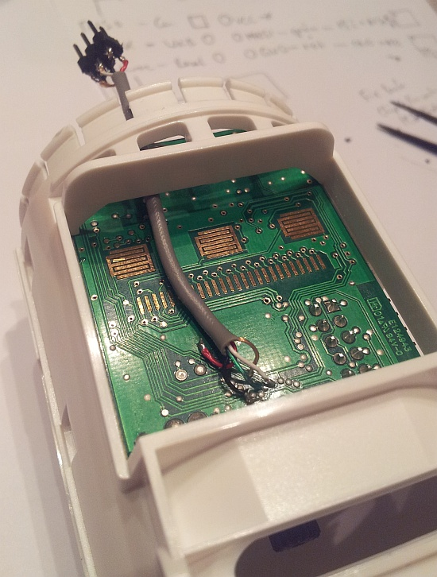

 - Project overview
    - What is provided
    - What hardware is supported
    - What hardware add-ons are supported

 - Hardware
    - Specs, pinouts, schematics, fuse settings of HR20, HR20-style, HR25, HR30
    - Hardware addons (RFM addons with schematics, images, pinouts, etc)
      http://embdev.net/topic/158895#1533392 (master board)

 - Firmware
    - OpenHR20 design overview
    - EEPROM layout

 - Compiling and uploading
    - Connecting JTAG or ISP (low speed)
      
    - How to compile and upload firmware (no way back!)
    - Required fuses

[ISP connector soldered to board](hr25_with_isp.jpg)

 - Historical docs
    - Original analysis PDF
    - Scope, logic analyzer, lcd and other images

### Flashing using openocd ###
(Taken from http://embdev.net/topic/118781?page=2#3495360)

Since I'm on Linux and own only a generic FT2232H JTAG interface (Olimex
ARM-USB-OCD-H), I had trouble flashing the firmware:
avrdude didn't work, since the built-in FT2232HIO driver works in
ISP-Mode only (and I didn't want to solder each device).

I looked around and could not find a way to program the devices via JTAG
only. The Atmel programmers and their clones seem to be the only way
when avrdude is involved.

OpenOCD does have some support for ATmega128, but it is very basic and
looks abandoned. Also, no obvoius way to change the fuses....  After
some google-foo, i found some info about "jam" and "svf" formats, which
could be played back via OpenOCD and used for programming fuses, flash
and eeprom (since they basically wiggle the pins and that's it).

Most relevant page is http://www.awce.com/avrjtag.htm (download
included).

I didn't find a hint of info on Atmel's web site about avrsvf....

So, I did the following:

 1. Compile OpenHR20 as needed.

 2. Use avrsvf (via wine) to generate an svf file for erasing + changing the
    fuses:

    avrsvf -dATmega169P -t4 -e -s -f0xFF9BE2 -F -ovhr20-fuses.svf

    The above options basically means:
     - produce heavily commented svf output
     - check the device signature first (otherwise svf aborts)
     - !!!! erase the device !!!!
     - set the 3 fuse bytes (ex, hi, lo) to 0xFF9BE2
     - verify the fuse bytes (otherwise svf aborts)
     - output file hr20-fuses.svf

    There seems to be an no longer maintained cross-platform tool for this:
    http://sourceforge.net/projects/avrsvf0/ But it does not support ATmega169P and
    I didn't want to take any chances.  Customizing may be possible, if Atmel
    didn't reinvent the wheel with different controllers and JTAG...

 3. Use avrsvf to generate a svf with erasure, fuses, flash and eeprom
    contents:

    avrsvf -dATmega169P -t4 -e -s -f0xFF9BE2 -F -pb -vb -iehr20.eep -ifhr20.hex -ovhr20.svf

    The above options basically means:
     - see 2.
     - program eeprom and flash
     - verify eeprom and flash
     - output file hr20.svf

 4. Connect via openocd + JTAG-dongle to the device. Set up a telnet
    port (4444) for a cli interface. My hr20.cfg for openocd:

        # for avr
           set _CHIPNAME avr
           set _ENDIAN little
        # jtag setup
        adapter_khz 500
        reset_config srst_only
        adapter_nsrst_delay 100
        #jtag scan chain
        if { [info exists CPUTAPID] } {
           set _CPUTAPID $CPUTAPID
        } else {
            # ATMega169V
           set _CPUTAPID 0x6940503F
        }
        jtag newtap $_CHIPNAME cpu -irlen 4 -ircapture 0x1 -irmask 0xf -expected-id $_CPUTAPID
        set _TARGETNAME $_CHIPNAME.cpu
        target create $_TARGETNAME avr -endian $_ENDIAN -chain-position $_TARGETNAME
        #$_TARGETNAME configure -work-area-phys 0x20000000 -work-area-size 16384 -work-area-backup 0
        set _FLASHNAME $_CHIPNAME.flash
        flash bank $_FLASHNAME avr 0 0 0 0 $_TARGETNAME

        Above code is stolen from avr-target config of OpenOCD, only
        \_CPUTAPID and the tap config was customized.  The flash part is
        optional, as is most of the config ;) Basically, you only need:

         - adapter_khz
         - reset_config
         - adapter_nsrst_delay
         - jtag newtap statement with irlen, expected-id

 4. Connect via

        telnet localhost 444

    to openocd, execute:

        svf hr20-fuses.svf
        svf hr20.svf

    ... and watch a few thousand JTAG-statements getting executed.
    I did set only 0,5MHz JTAG speed, but it thould take <10s to flash (or
    error out). I had trouble getting 4,5MHz (from original avr OpenOCD
    config) to work, verifying the flash failed, but fuses where fine.

#### Conclusion ####
The above should be a generic guide to flashing all types of AVR MCUs
via JTAG and OpenOCD and should basically be cross-platform, except the
usage of avrsvf. So, it is possible to live without avrdude ;)

Caveats encountered:

1. Setting fuses only works after erasing the device.
   A reset is needed in between, easiest way was 2 svf scripts.
2. My HR-20 Style have an Atmel ATmega128PV MCU (note the P!!), which
   has 3 fuse bytes. All existing bytes need to be set with avrsvf.
3. ATmega128(V) and ATmega128P(V) have the same JTAG signature,
   but setting fuses works only when the correct type is selected
   Needed some time to realize this, a real "doh!" moment....
4. avrsvf is Windows-only, but has a config file which may enable new
   types of MCUs and has no dependencies at all so i deemed it well
   worth the wine hassle..
5. SVF files seem pretty simple, it may be possible to create a
   template which sets up the flash and insert hex/eeprom contents
   into it. May be some evil shell-script hackery, but since .hex
   and .eep are already in hexadecimal it should not bee to difficult
   to hack some `SDR 15 TDI($VALUE);` around it...
